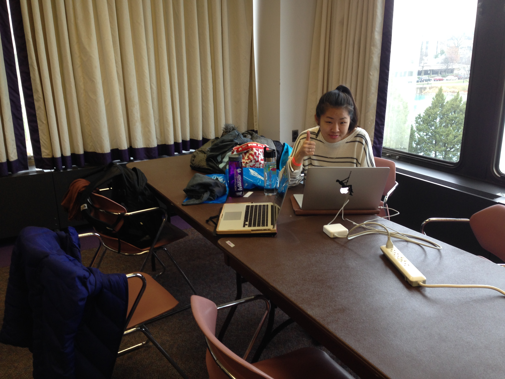

It's 10:53 AM on a Saturday morning. My friend [Summer](https://twitter.com/suymilk) and I are attending our first intercollegiate hackathon - [Wildhacks](http://wildhacks.org). We've secured a spot in the corner of the Northwestern Room on the second floor of the student center overlooking the Lakefill. We've also laid claim to a power strip.

We're not in this hackathon for the prize money - we're doing it just to have the experience of building something in 24 hours or less, and also so we'll be a little less scared of doing hackathons in the future. I'll be liveblogging WildHacks just for [shiggles](http://www.urbandictionary.com/define.php?term=shiggles).

### 11 AM
As expected, this hackathon is overwhelmingly male. The group of guys next to us have already requested a whiteboard (they were told that there's a lot of paper that they can use).

`verbatim`

+ "That's the most expensive mouse pad I've ever seen."
+ "We're counting the number of commits, not the quality of commits."

`caffeine intake`
+ 1 cup of Dunkin Donuts coffee

### 1 PM
Highlights of the opening ceremony were the Syndio Social Nicolas Cage Challenge (casually include Nic Cage somewhere in your project) and PayPal/Braintree/Venmo's API walkthrough - apparently it's really easy to build a mobile app to charge people to pet your blind dog (so you can raise money for his eye surgery, obviously).

Summer and I outlined our web app idea over lunch and are ready to start hacking. We're both student fellows at the [Knight Lab](http://knightlab.northwestern.edu), a news innovation lab on campus, so our project is going to be news-centric. We've set up our Github repo and 

`verbatim`
+ "I just charged myself $216 to pet my own dog."
+ "So cute, so blind."

`caffeine intake`
+ 1 can of Diet Coke