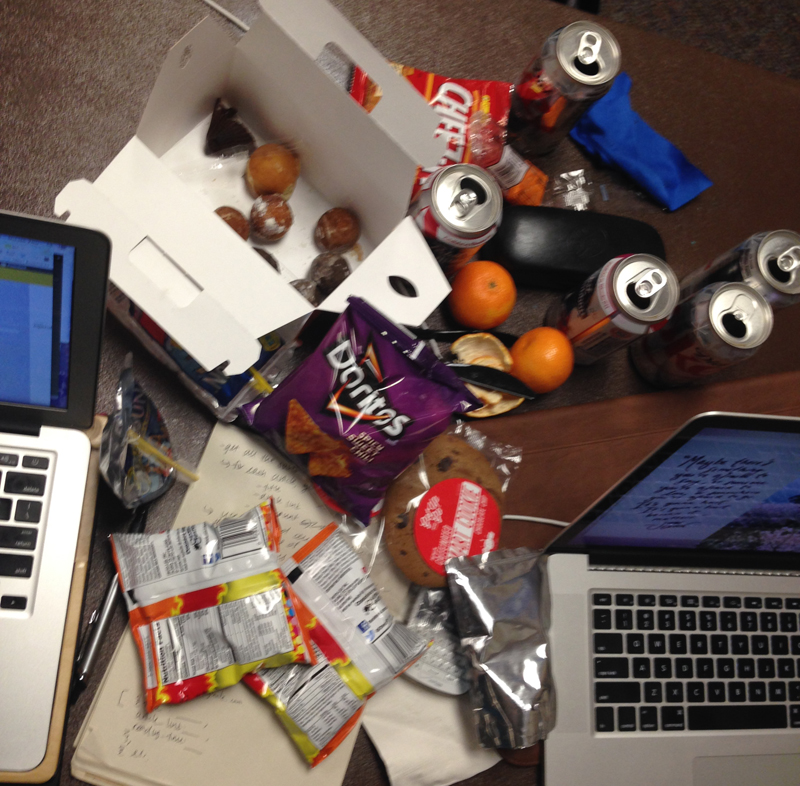

It's 10:53 AM on a Saturday morning. My friend [Summer](https://twitter.com/suymilk) and I are attending our first intercollegiate hackathon - [Wildhacks](http://wildhacks.org). We've secured a spot in the corner of the Northwestern Room on the second floor of the student center overlooking the Lakefill. We've also laid claim to a power strip.

We're not in this hackathon for the prize money - we're doing it just to have the experience of building something in 24 hours or less, and also so we'll be a little less scared of doing hackathons in the future. I'll be liveblogging WildHacks just for [shiggles](http://www.urbandictionary.com/define.php?term=shiggles).

### 11 AM
As expected, this hackathon is overwhelmingly male. The group of guys next to us have already requested a whiteboard (they were told that there's a lot of paper that they can use).

`verbatim`

+ "That's the most expensive mouse pad I've ever seen."
+ "We're counting the number of commits, not the quality of commits."

`caffeine intake`

+ 1 cup of Dunkin Donuts coffee

### 1 PM
Highlights of the opening ceremony were the Syndio Social Nicolas Cage Challenge (casually include Nic Cage somewhere in your project) and PayPal/Braintree/Venmo's API walkthrough - apparently it's really easy to build a mobile app to charge people to pet your blind dog (so you can raise money for his eye surgery, obviously).

Summer and I outlined our web app idea over lunch and are ready to start hacking. Since We're both student fellows at the [Knight Lab](http://knightlab.northwestern.edu), a journalism-technology lab, our project is news-centric. Things we've done so far: setting up a Github repo, an initial deploy to Heroku to get a live link to our project, and starting to dive into some APIs we'll be using.

`verbatim`

+ "I just charged myself $216 to pet my own dog."
+ "So cute, so blind."

`caffeine intake`

+ 1 can of Diet Coke

### 6:30 PM
Summer and I have spent the last 5.5 hours trying to figure out the Pocket API (it really should not have been that hard but neither of us have much experience with servers or OAuth). After trying Ruby gems, Python wrappers, ngrok tunneling, and 381038471 other things, we finally settled on a pocket-ruby gem (which has all the API methods we need) and started learning how to write a Sinatra app. Restructured our repo again and I got it redeployed to Heroku. Looks like we're both going to learn some Ruby tonight. Next steps: Google Calendar API and some more Sinatra stuff.

Already feeling the ups and downs of this hackathon - we were feeling hopeless after 4 hours of fruitless Googling and a few broken lines of code. We had a moment of doubt (can we even build this thing??) but Summer suggested we spend one more hour trying to make progress before we changed ideas. When in doubt, keep hacking.

`caffeine intake`

+ none, but we did eat six donut holes

### 10 PM
We figured out what a Ruby hash is and were sort of able to iterate over them, extract what we need, and print the results. Summer succeeded in tapping into the Google Calendar API but she did it via the server-side which is basically useless to us. But it was still cool to see her add an event to her calendar using the command line.

After more unsuccessful Sinatra troubleshooting, we have sent out a [desperate tweet](https://twitter.com/suymilk/status/536368607039864833) for help. Currently waiting for a resident Ruby/Rails/Sinatra guru to come help us. We're going to eat more clementines.

`verbatim`

+ "As our desperation increases, so do the number of clementines."

`caffeine intake`

+ 1 can of Diet Coke

### 12 AM
HALFWAY POINT!!! My right eye is already bloodshot.

Ryan found us in our sad corner and helped Summer try to get Google OAuth working in Ruby. They found that the Google API sucks - turns out there were layers of gems with typos other errors, and they tried to incept a gem within a gem within a gem and eventually found out that it was just constantly breaking and awful to deal with. So for the purpose of the demo, we're just going to use a public Google Calendar. Meanwhile, I learned how to render the data from the app controller (FINALLY). I've never been so happy to see poorly rendered HTML.

It was really awesome to have ~* Ryan the mentor *~ help us troubleshoot things. He reminded us that hackathons are mostly for learning and that "building tenacity is the most important thing." And that you shouldn't copy and paste code because you're not really learning what it's doing.

`verbatim`

+ "Scroll down: sex."
+ "Get me better water."

`caffeine intake`

+ does 1 pack of Capri Sun count

### 2:30 AM
WE ARE GOING crAZY but things are going alright. I figured out how to calculate the reading time for an article and rendered all the right parameters in an erb template. Summer got a public Google Calendar working and has calculated the free time between scheduled events, so we're going to start to figure out a way to integrate what we've both been working on pretty soon. Accomplished all of this while eating so much junk food:

We've reached that point in the night where Summer brushes her teeth at her computer and wonders aloud why it people call it "iced tea" instead of "cold tea." And I'm in a Cookie Monster snuggie.

`verbatim`

+ "I've never brushed my teeth in front of so many people."
+ "We started hacking at noonthirty. Oh my God it's 2 AM."

`caffeine intake`

+ 1 smart cookie (a chocolate chip cookie infused with caffeine - it is not as good as it sounds but I think it's working)

### 6:45 AM
Things are ALMOST completely working. Switched from Ruby to good ol' JSON and jQuery and did a lot of roundabout calls to get a random article whose reading time is less than the time difference between two scheduled events in a Google Calendar. Summer's been dealing with Moment.js and creating new Google Calendar events.

We came up with a name for our app: Pickpocket (since we're picking articles for users to read from their own Pocket accounts). I made our app logo (and a Nicolas Cage easter egg) and worked on some UI.

No `verbatim` or `caffeine intake`