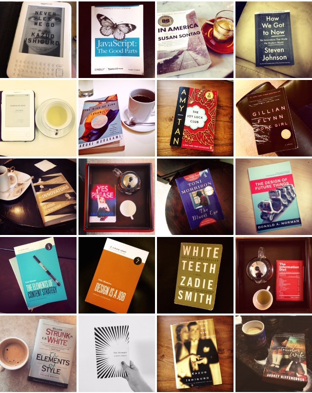
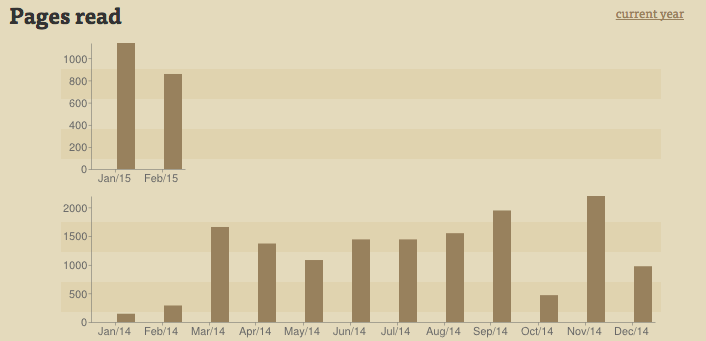

In February 2014, I decided to read a book a week for a year. 

It’s February 2015 and OH MY GOD I DID IT.

## What would possess a person to read 52 books in 52 weeks?
This time last year, I felt buried by school work and Chicago snow. I’d already abandoned whatever half-assed New Year’s Resolutions I jotted down in some journal. Then, I read this [great Medium article](https://medium.com/@julien/how-to-read-a-book-a-week-20675f2e206c?source=reading-list) by Julien Smith - he’s read a book a week for *five years straight*.

I like that he not only spoke about the benefits of doing such a massive challenge (building a “habit of completion”), but also listed concrete ways to achieve that goal, such as taking things “one day at a time” and making it a “routine.” Reading is something I’ve loved ever since I was a kid (I even competed in [Kids’ Lit. Quiz](http://www.internationalschool.info/isb-middle-school-kids-lit-quiz-team-victorious/) - an international reading trivia competition in middle school). But ever since I started college, I stopped reading for pleasure. I blamed it on school or my schedule - “*I just don’t have the time*.”

Smith’s article was a kick in the butt: “just do it already.” I decided that it was finally time to stop making excuses (because I somehow always found time to watch *30 Rock* reruns on Netflix).

Likewise, I greatly encourage people to take on this challenge. Even for people who already read 109312 tweets and articles every day, reading books builds a different set of habits and has its own set of rewards. You learn so much more without the distraction of notifications or the temptation to Pocket or bookmark something to read later. And if you can read 52 books in 52 weeks, you will have read [twice as much](https://www.facebook.com/zuck/posts/10101828640656261?pnref=story) as Mark Zuckerberg.

### Pages read per month:

	<canvas id="canvas" height="450" width="600"></canvas>

## 52 weeks later, here’s what I learned:

You can accomplish more than you think you can. This means developing a habit, and I’ll admit, it’s hard. The first 1-2 months are the toughest. I had midterms, got sick, and was traveling across the country all within the same week (week 4) and I wanted to give up so badly. I tried to rationalize that I’d only read 3 books, that it was ok to back out. Instead, I just chose a shorter book and read it while I was bedridden over spring break. Make it over that initial hump, because afterwards, it just becomes a part of your regular schedule. I now always set aside Saturday afternoons for coffee and a good book.

Set quantifiable goals. Quit saying “I want to read more” and be specific. How many books (52 perhaps)? What kinds of books (essays, graphic novels)? What authors (Didion, Fitzgerald)?

Embrace mini milestones. Take it one book, one week at a time. Keeping your eye on the next thing (not the big picture) takes away the scariness and that feeling of “I could never possibly do this.” *You can.*

Routine is a great thing, but also you shouldn’t be too hard on yourself if you aren’t on track 100% of the time. It’s ok if you fall a little bit behind so long as you keep the end goal in mind and catch up soon. Lose the battle, win the war.

Libraries are amazing. Seriously. I know we live in a world of 2-day Amazon Prime shipping and [random strangers buying you chicken nuggets at McDonald’s](https://postmates.com/), but can we just appreciate how awesome libraries are? That you can check out *any book for free* is crazy. [Having fun isn’t hard when you’ve got a library card.](http://www.quirkbooks.com/sites/default/files/editor_uploads/original/arthur-library.jpg)

## How I read 52 books in 52 weeks

I initially tried to take Julien Smith’s advice and read a little bit every day (a 300-page book is a lot less daunting if you read 42 pages everyday). While I was in school, I filled the awkward breaks between classes or before meetings instead of going on Facebook.

Over the summer, I got into the habit of blocking out Saturday afternoons to read in coffee shops. I got to explore DC - *Americanah* at The Coffee Bar, *In America* in Dolcezza Gelato, *Me Talk Pretty One Day* in The Uprising Muffin Company, *Never Let Me Go* in Peregrine Espresso, *This Is How You Lose Her* in Meridian Hill Park.

When I’m particularly busy, I read shorter books (100-200 pages) and make up for it by either reading a longer book (300-500 pages) the next week, or by reading a longer book concurrently (that might take me 2-3 weeks to finish).

I read while traveling. In the last year, I’ve gone to London (Flynn), Shanghai (Murakami), Philly (Ishiguro), and New York (Marquez). I read on planes and trains (stopping myself before I become Dr. Seuss), the DC Metro, the Chicago El, etc.

I rediscovered secondhand bookstores and libraries. Borrowing books from the library was a double win because they were free and most books only circulate for a week.

I’m a big believer in sharing and tracking (sorry, Ron Swanson). From the very start, I’ve tweeted every book I read:

<blockquote class="twitter-tweet" lang="en">
1/52: &quot;How to Be Alone: Essays&quot; by Jonathan Franzen <a href="https://twitter.com/hashtag/52booksin52weeks?src=hash">#52booksin52weeks</a>
&mdash; Nicole Zhu (@nicolelzhu) <a href="https://twitter.com/nicolelzhu/status/437033953300463616">February 22, 2014</a></blockquote>

<blockquote class="twitter-tweet" lang="en">
52/52: &quot;The Elements of Style&quot; by William Strunk and E.B. White <a href="https://twitter.com/hashtag/52booksin52weeks?src=hash">#52booksin52weeks</a>
&mdash; Nicole Zhu (@nicolelzhu) <a href="https://twitter.com/nicolelzhu/status/568815064146255872">February 20, 2015</a></blockquote>

I told my friends about it. What was awesome and totally unexpected was that it became a regular topic of conversation - people would just ask me what my book of the week was in a meeting or at a party. Tracking that goal in public and sharing my progress with people motivated me to keep going, even if there were really busy weeks where I felt that I couldn’t possibly go on. Even though reading is a largely solitary activity, the process of reading 52 books in 52 weeks doesn’t have to be.

## How I track what I read
I tweet out a book when I finish it. I use Lift (now [Coach.me](https://www.coach.me/)) and [Goodreads](https://www.goodreads.com/) to track day-to-day progress. I initially resisted Goodreads and used [bookqueue](http://bookqueue.net) (an “anti-social” reading application) until I started telling people about what I was doing and wanted to share my reading lists with them. I still like using bookqueue for its nifty visualization of the pages you’ve read each month.

Around week 15, I started taking pictures of the books I read and posted them to Everest (another goal-tracking mobile app, but it was unfortunately shut down in the last year).

## How I choose books to read
I keep an extensive Evernote of books to read that I usually add to when I’m perusing the shelves in a bookstore. I took recommendations from friends (*Norwegian Wood*), read the books I received as gifts (*Out Stealing Horses*), or read more authors whose work I read in class (Cheryl Strayed, Joan Didion, Don Norman). During lazy weeks, I just read whatever’s on my bookshelf. 

A lot of the nonfiction books I read to geek out (*Nine Algorithms That Changed the Future*) or learn something (*JavaScript: The Good Parts*). Some of the books were also in response to whatever was playing in theaters (*The Imitation Game*), or even current events (*To Kill a Mockingbird* around the time of Darren Wilson’s non-indictment).

## A few favorites

**Books**:

- *Americanah* by Chimamanda Ngozi Adichie
- *Wild* by Cheryl Strayed
- *The Wind-Up Bird Chronicle* by Haruki Murakami
- *The Design of Everyday Things* by Don Norman
- *White Teeth* by Zadie Smith
- *The Unbearable Lightness of Being* by Milan Kundera
- *To Kill a Mockingbird* by Harper Lee
- Joan Didion and E.B. White essay collections
- *The Information Diet* by Clay Johnson

**Authors**

- Haruki Murakami
- Steven Johnson
- Kazuo Ishiguro

## What’s next?
I’ll probably continue reading a book a week - it’s just such a part of my routine now. However, I also want to tackle other things that I’ve always said I’m just “too busy” for - writing [750 words](http://750words.com) everyday or [going to the gym](https://uproxx.files.wordpress.com/2013/02/ann-perkins-jogging.gif) 3 times a week. Either way, I'm going to take what I learned from this reading project and apply it to the next insane goal.

