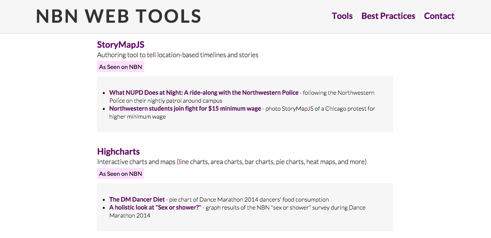
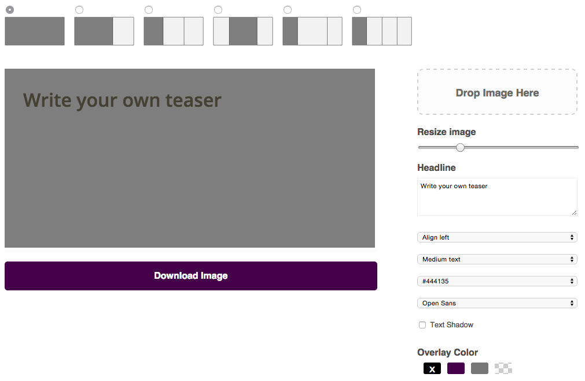

Last fall, I took on the position of Creative Director at [North by Northwestern](http://northbynorthwestern.com) (NBN), Northwestern University’s independent online publication on campus and culture. My main goal was to encourage our staff to take advantage of the web as a storytelling medium, especially since we have great multimedia and interactive teams here at NBN. During an editors meeting, I was asked to talk about just that -- ways to tell excellent stories on the web. While it could have been just a fifteen minute talk with a follow-up email containing a list of helpful links, I saw an opportunity to make something that wouldn’t get lost in someone’s inbox and could be used as a reference guide regardless of our quarterly staff turnover.

#### Introducing [NBN Web Tools](http://nbnwebtools.herokuapp.com/) (a work in progress):

## Compiles storytelling tools
The very first version of NBN Web Tools was just a website that organized and compiled storytelling tools ranging from making interactive maps to creating social sharing images. By centralizing these resources, writers only need to reach out to the interactive section when they can’t find an existing tool to meet their needs. 

In the second version of the site, I added in examples of how each tool has been used on NBN. By linking to real stories, people can not only get a feel for how the tool can be applied to our publication, but can also be inspired to use the tool in their own unique ways.

## Outlines best practices for working with our interactive team
When I was Interactive Editor, the majority of our projects were  requests from other sections to “make their stories interactive.” The process was similar to the [waterfall method](https://en.wikipedia.org/wiki/Waterfall_model) in software development -- pitch, report, write, edit, design, code -- in that order. That meant that we only ever came in at the end of the process, so the design and development would be constrained by the fact that the story was already complete by the time we started working on it.

Even among us ~new media teens~, the work the interactive section does is often seen as a black box (rather, a black screen with [scary green hacker text](http://dtrace.org/blogs/brendan/files/2011/09/macdtrace04.png)). I wrote a few paragraphs summarizing best practices for working with the interactive team to highlight that (1) they are not just a service desk, (2) “making things interactive” requires intent and communication, and (3) design and code are also methods of storytelling that should further the reader’s experience in some way. I wanted to highlight that producing great interactive stories requires the collaboration and strengths of all parties involved, and that planning, organization, and coordination between sections are what result in some of the [most](http://apps.northbynorthwestern.com/hungry/) [compelling](http://apps.northbynorthwestern.com/gameday/) [stories](http://apps.northbynorthwestern.com/passing/).

## Takes advantage of open source
Coming off my first summer interning at Vox Media where I worked  on a [quiz authoring tool](http://product.voxmedia.com/2014/8/7/5975499/quiz-whiz), I took advantage of open source for the first time. I forked and customized their [Quiz Generator](https://github.com/voxmedia/quiz-generator) and [Meme Generator](https://github.com/voxmedia/meme) with NBN’s styles so that we could also create interactive quizzes/flowcharts and step up our social media game.

Open source has also helped us build tools that make our workflow easier. One pain point for our managing editors has been creating teasers (images previewing content published that night). Teasers are simply images with text on them, but because there are so many variations and combinations in the number and size of teasers, making them in Photoshop can be a tedious process. Since the Meme Generator does something similar to create social sharing images -- uploading an image, adding text and overlays, and customizing fonts and colors -- I forked and modified the repo to create a [Teaser Generator](http://nbnwebtools.herokuapp.com/teaser). I worked with our editor-in-chief to add additional features that the managing staff would want, like a transparent overlay or the ability to change the text color.

As we embark on a [website redesign](http://nbn-sandbox.tumblr.com/post/113945798180/hello-world), building and adapting open source tools can be a helpful intermediate solution to make certain parts of our workflow easier.

 

###### [NBN Web Tools](https://github.com/northbynorthwestern/nbn-tools) is built with [Middleman](https://github.com/middleman/middleman) and hosted on [Heroku](http://heroku.com). Check out more projects by North by Northwestern [on GitHub](https://github.com/northbynorthwestern)!
