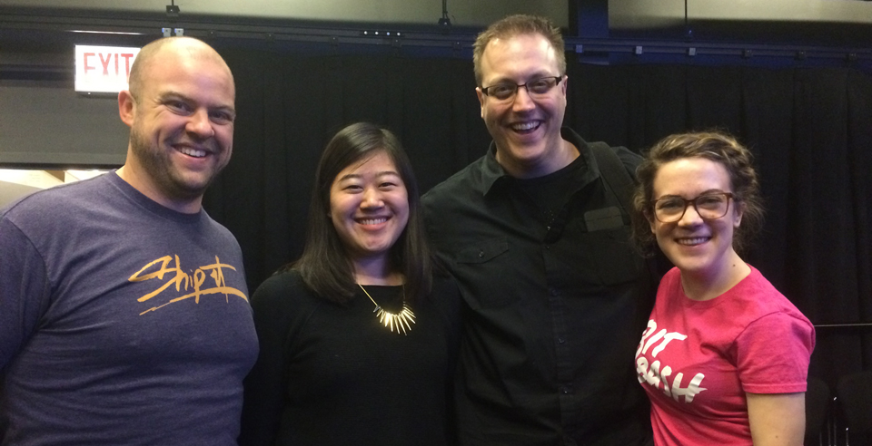

At [SNDMakesChi](http://www.snd.org/2016/02/check-out-the-sndmakes-chicago-gaming-prototypes-plus-links-to-demos-repos-and-presos/), Team Printer’s Row designed and prototyped [I Want In](https://iwantingames.herokuapp.com/), a platform that connects gamemakers and playtesters. We tested our initial hypothesis - that playtesters are important but hard to find - by talking to some game developers who responded to our teammate Charlie’s [Bat Signal](https://twitter.com/Charlie_L_Hall/status/696014936405725184).

Team Printers Row (left to right): <a href="https://twitter.com/chriscoyier">Chris Coyier</a>, <a href="https://twitter.com/nicolelzhu">me</a>, <a href="https://twitter.com/Charlie_L_Hall">Charlie Hall</a>, <a href="https://twitter.com/allysonkate">Allyson Wakeman</a>

We learned that game developers often test with friends and family or find testers from the same sites and online communities, have a low budget for QA (and in some cases a random volunteer may be better than a hired person for QA), and find it challenging to get quality feedback from testers. We developed two personas: a gamemaker and a playtester.

**Gamemaker:**

- Need specialists or generalists (or even people who don’t play games)
- Not all testers provide actionable feedback
- Playtests have a goal, whether that’s to test a specific level or feature or the whole game
- Zero budget
- Some have closed development processes, others have open development processes

**Playtester:**

- Expect incentives for their time
- Will sometimes even pay for “early access”
- Aspect of community is important

Our platform aimed to address both gamemaker and playtester needs: gamemakers want more testers, a more diverse pool of testers, and higher quality testers while playtesters want games, a sense of community, and a sense of growth or progression. Our prototype, I Want In, bridges this gap. [Gamemakers](https://iwantingames.herokuapp.com/post/) can post a game to test and specify the kinds of testers they’re looking for (i.e. age, experience, gender, etc.), as well as [request, approve, or deny](https://iwantingames.herokuapp.com/dashboard/) playtesters for their [games](https://iwantingames.herokuapp.com/game/). For the sake of anonymity and limiting bias, games can only be identified by name or game-type. [Playtesters](https://iwantingames.herokuapp.com/signup/) can sign up for an account on I Want In, request to test games, and [build up expertise](https://iwantingames.herokuapp.com/profile/) in different types of games (i.e. RPG, strategy, driving, hidden object, etc.). To reinforce positive contributions from playtesters, gamemakers would be able to rate playtesters in a “rate the rater” kind of way.

<blockquote class="twitter-tweet" data-lang="en">
“I want in” from Team Printer&#39;s Row <a href="https://twitter.com/hashtag/SNDMakes?src=hash">#SNDMakes</a>-Chi <a href="https://t.co/E9lWtLgo8n">pic.twitter.com/E9lWtLgo8n</a>
&mdash; SND (@SND) <a href="https://twitter.com/SND/status/696481476708212736">February 7, 2016</a></blockquote>

In addition to talking to users in the needfinding stage, we were able to test our prototype on the last day with additional game developers who gave us some useful feedback:

- Would like a well-rounded group of playtesters - people who play lots of games and people who don’t play at all
- Want to stage playtest groups
- Approve active builds so the most recent code gets to the right people at the right time
- How to evaluate gamers and non-gamers’ feedback
- Allow devs to request players who are fans of a particular genre
- Want to specify % complete of the game they’re testing as opposed to the existing terminology of “alpha, beta, etc.”
- How to evaluate playtesters?
- Guarding game ideas
- How to remove or limit bias in playtesting

One major feature we discussed a bit but ultimately decided not to focus too much time on was feedback. What kinds of feedback are most helpful for game developers? How can we incentivize quality feedback from playtesters? If the most valuable feedback is observation and talk alouds, how might we find an alternative that works for playtests that aren’t done in person? We settled on allowing the gamemaker to specify a question for which the playtester would leave audio feedback, but iterating on this would be something more significant to think about in the future.

 

###### [I Want In](https://iwantingames.herokuapp.com/) is built with [Middleman](https://github.com/middleman/middleman) and hosted on [Heroku](http://heroku.com/). Check out the [repo on GitHub](https://github.com/nicolezhu/playtesting) and our [presentation slides here](https://docs.google.com/presentation/d/1NV5ndEDgpt_2JxhuT4tpmnt8O5G5PCvU8VeOufZ71Dc/)!
