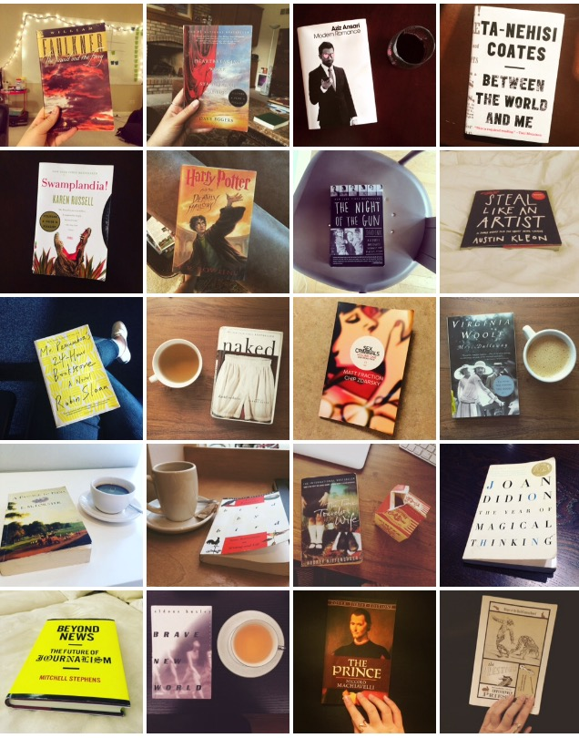

BACK AT IT AGAIN WITH THE 52 BOOKS (I’m probably going to regret making this February 2016 [meme reference](http://www.nytimes.com/2016/02/26/style/damn-daniel-video-vans.html?_r=0) very soon). I read 52 books in 52 weeks for the second year [in a row](http://nicolezhu.github.io/52-books-in-52-weeks/)!

## What I did differently this year
Unfortunately, I did not stick to as strict a schedule of reading a book a week. There ended up being waves of not reading anything at all and waves of intense reading, like when I read eight books in the last two weeks of December in an effort to finish my first [Goodreads Challenge](https://www.goodreads.com/user_challenges/2327644) of 52 books in a single calendar year. Because I was taking so many liberal arts and humanities classes to finish out my English minor and distribution requirements for graduation, I decided to include books I read for school. I reread more books and read a wider variety of books - graphic novels, nonfiction, and essays. I’ll admit that I wasn’t nearly as conscientious about what I read, and it shows in the diversity of books I finished.

### Pages read per month:

	<canvas id="canvas" height="450" width="600"></canvas>

## Breakdown of books I read:
Most of the books I read were by male authors (35) compared to female authors (17) - again. I realized that I really had to make an active choice to read books by non-male authors, because my default would otherwise just be something written by a white dude. I also noticed the bias in my classes. I took an entire class on Faulkner, a class on post-WWI trauma novels, and currently a class on medieval literature and another on Renaissance Romance. Out of the eleven books on the syllabuses for five classes, only one - *Mrs. Dalloway* - was written by a woman. I only read 13 books by people of color (unfortunately that just means non-white).

Most of the books I read were between 200-400 pages long. I bought way more books this year even while I was living in DC over the summer and then shipped them back to Chicago.

## How to make reading 52 books in 52 weeks more fun
**Make it a treat or something you look forward to**, like Dale Cooper’s [two cups of black coffee](http://kingcheddarxvii.tumblr.com/post/99385339342) in *Twin Peaks*. I continued my Saturday afternoon ritual of reading in a coffee shop for a few hours, sans pie unfortunately.

**Do a book swap.** One of my friends organized and hosted this swanky cocktail party with the premise of bringing a book to swap, and you would keep swapping books (if you wanted to) throughout the night so that you’d leave with something new to read. I brought *Mr. Penumbra’s 24-Hour Bookstore* and left with *The Enchanted*. Also, asking what book someone had was always a fun, non-creepy icebreaker that led to good conversation.

**Read the book, then watch the movie adaptation.** *The Prestige* is one of my favorite movies and when my boyfriend lent me his copy of the book, I had an excuse to rewatch it (this was around the time of David Bowie’s death). I also had the added bonus of discussing the differences between the page vs. screen adaptation like the giant nerd I am. Next on the list is *The Talented Mr. Ripley*.

**Go to a bookstore with a friend and recommend each other a few titles.** It’s more fun if you go to a secondhand bookstore that requires contorting yourself into awkward positions to find your favorite author or serendipitously finding a book you haven’t thought about in years.

**Snoop around your friend’s bookshelf.** I always think that a person’s bookshelf is really telling about their personality, and you’ll not only find good recommendations but you can also borrow it from them and talk about it later.

<blockquote class="twitter-tweet" data-lang="en">
1/52: &quot;The Opposite of Fate&quot; by Amy Tan <a href="https://twitter.com/hashtag/52booksin52weeks?src=hash">#52booksin52weeks</a> <a href="http://t.co/acsJwFfyy1">pic.twitter.com/acsJwFfyy1</a>
&mdash; Nicole Zhu (@nicolelzhu) <a href="https://twitter.com/nicolelzhu/status/574650167321849856">March 8, 2015</a></blockquote>

<blockquote class="twitter-tweet" data-lang="en">
52/52: &quot;The Autobiography of Malcolm X&quot; by Malcolm X as told to Alex Haley <a href="https://twitter.com/hashtag/52booksin52weeks?src=hash">#52booksin52weeks</a> <a href="https://t.co/tC6ZjKMy4b">pic.twitter.com/tC6ZjKMy4b</a>
&mdash; Nicole Zhu (@nicolelzhu) <a href="https://twitter.com/nicolelzhu/status/702657130596151296">February 25, 2016</a></blockquote>

## How I track what I read
I tweet out a book when I finish it with the hashtag [#52booksin52weeks](https://twitter.com/search?q=%2352booksin52weeks%20from%3Anicolelzhu&src=typd). I use [Coach.me](https://www.coach.me/) and [Goodreads](https://www.goodreads.com/) to track day-to-day progress. I’m pretty much a [Goodreads convert](https://medium.com/@jm3/why-i-goodreads-6ee4b3513633#.g7n4adh43) now because it’s really the only book/reading-tracking site out there, and I’ve come around on the idea of social reading. Plus, it has that nifty reading challenge feature, the ability to sort books by shelves, and if you have friends whose taste in books you respect, you can get pretty good recommendations from the homepage’s updates.

## How I choose books to read
If I’m not keeping up with readings for class (*As I Lay Dying*, which describes my experience reading Faulkner), I peruse my bookshelf or [to-read shelf](https://www.goodreads.com/review/list/5789743?shelf=to-read) on Goodreads and check something out from the library. When I’m scrolling through Twitter and see books that [authors](http://roxanegay.tumblr.com/post/136625856240/my-2015-in-reading), [journalists](https://twitter.com/JessicaValenti), or other people I follow have recommended, I automatically add those to my to-read list. If a friend lends me a book (*The Martian*, *Sex Criminals, Vol. One*), that will usually go to the top of the list. I’ve also found that [Mic](http://mic.com/articles/135014/29-essential-books-for-black-history-month-you-never-got-assigned-in-school?utm_source=policymicTBLR&utm_medium=main&utm_campaign=social#.ImKFTRd1N) and [BuzzFeed](http://www.buzzfeed.com/ariannarebolini/books-that-are-actually-honest-about-mental-illness?bftw&utm_term=.ig87m9MDX2#.ccyqdgKrGm) can be good sources for more diverse books.

## A few favorites

- *The Autobiography of Malcolm X* by Malcolm X
- *Bird by Bird: Some Instructions on Writing and Life* by Anne Lamott
- *Between the World and Me* by Ta-Nehisi Coates
- *On Beauty* by Zadie Smith
- *Kafka on the Shore* by Haruki Murakami
- *A Heartbreaking Work of Staggering Genius* by Dave Eggers

## What I’m doing differently this year
This year, I want to be more conscientious of the books I dedicate my time to. I read [this essay](http://www.vox.com/2015/12/29/10634416/reading-list-books) by a woman who outdid me and read 164 books in 2015 and tracked them all in this intense, amazing [spreadsheet](https://docs.google.com/spreadsheets/d/1f6OqC9c9wpZooYW0hip8QtoCwkNjsjbwXHY8hCDbTtU/edit#gid=952505333) that I’ve now cloned and modified. In addition to updating [Goodreads](https://www.goodreads.com/user/show/5789743-nicole), I’ll also be updating [this spreadsheet](https://docs.google.com/spreadsheets/d/1JTrkx_8jeIJ_Q3vwwppr4_n9XULfNeD0Rt7ccMktums/edit?usp=sharing). I’m making it my goal this year to read more books by and about women and/or people of color.

I also *really* want to do a book club this year similar to [Rachel Syme’s](https://twitter.com/rachsyme) [#wlclub](https://twitter.com/hashtag/wlclub?src=hash&lang=en) so if you’re interested, let me know!

