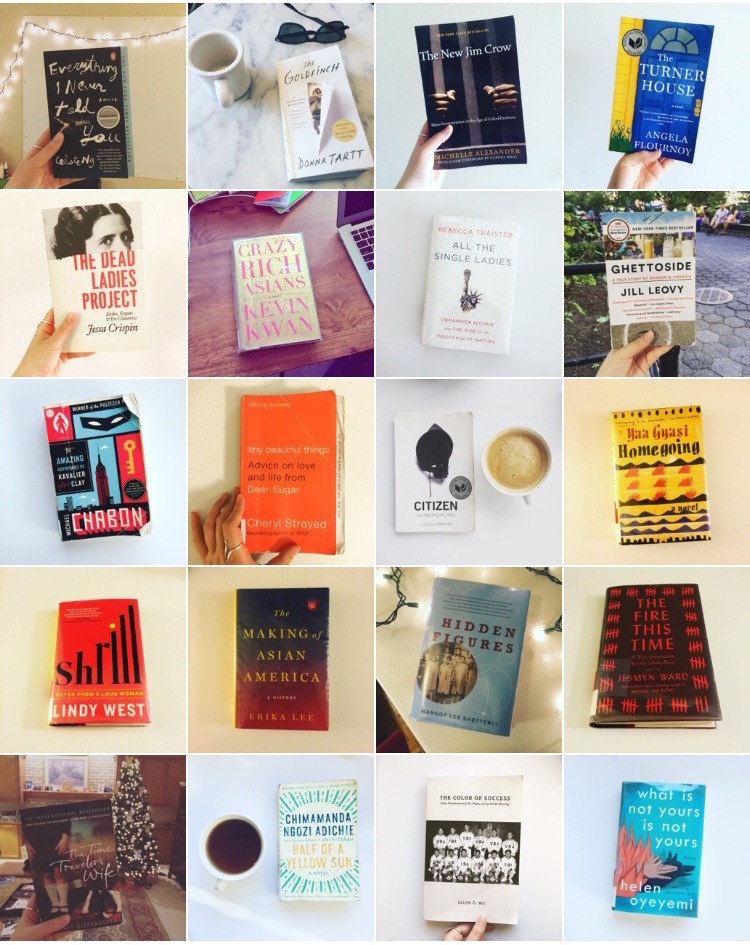

What started as a dumb challenge to myself to read 52 books in 52 weeks is now in its [THIRD YEAR](https://www.goodreads.com/review/list/5789743-nicole?shelf=52-books-in-52-weeks-2016). Also I somehow turned this into a [lightning talk](https://www.youtube.com/watch?v=QyCg8SwRAi8) I gave at a conference last year. (See blog posts from [2016](http://nicolezhu.github.io/52-books-in-52-weeks-year2/) and [2015](http://nicolezhu.github.io/52-books-in-52-weeks/)).

## What I did differently this year
For the last two years, the percentage of female authors I read has hovered stubbornly around 30% and last year, I realized that if I'm not conscientious about the books and authors I'm reading, I tend to read mostly books by (white) men. So this year, I made the active choice for at least half the books I read this year to be by women/people of color. The final count ended up being 42 books by women, 20 of those written by women of color, and 10 books by men, 6 of those written by men of color.

I also decided to be more detailed in keeping track of what I read and why, so I adopted the [idea](http://www.vox.com/2015/12/29/10634416/reading-list-books) for an extensive book-tracking spreadsheet and [started my own](https://docs.google.com/spreadsheets/d/1JTrkx_8jeIJ_Q3vwwppr4_n9XULfNeD0Rt7ccMktums/edit?usp=sharing).

### Pages read per month:

    <canvas id="canvas" height="450" width="600"></canvas>

## Breakdown of books I read:
I read fiction vs. nonfiction pretty evenly this year, even though I generally prefer reading fiction. In terms of nonfiction, I read memoirs (Lindy West, Jessica Valenti, Maya Angelou), books about feminism and gender (*All the Single Ladies: Unmarried Women and the Rise of an Independent Nation*, *Full Frontal Feminism*), rape culture (*Missoula: Rape and the Justice System in a College Town*), education (*Pushout: The Criminalization of Black Girls in Schools*), race (*Hidden Figures*, *The New Jim Crow*, *The Fire This Time*, *Citizen: An American Lyric*), and racial politics (*The Color of Success*, *Dog Whistle Politics*).

The best fiction I read this year were Yaa Gyasi's *Homegoing* and Hanya Yanagihara's *A Little Life*, both of which are sprawling epics of immeasurable suffering, circumstance, and perseverance.

Most of the books I read were between 200-400 pages long, though I did read some 600-800 page books (*A Little Life*, *The Goldfinch*, and *The Making of Asian America*). I took advantage of my university library before I graduated, and after moving to New York, joined the New York Public Library, which has kept me with 3-4 books on deck at any given moment and the due dates have honestly been the most effective way of making sure I finish books on time. I love libraries — seriously, join a library. [And support your local library!](https://twitter.com/_becca_donnelly/status/815719582312890368)

<blockquote class="twitter-tweet" data-lang="en">
1/52: &quot;The Enchanted&quot; by Rene Denfeld <a href="https://twitter.com/hashtag/52booksin52weeks?src=hash">#52booksin52weeks</a> <a href="https://t.co/TQT7i5Arz3">pic.twitter.com/TQT7i5Arz3</a>
&mdash; Nicole Zhu (@nicolelzhu) <a href="https://twitter.com/nicolelzhu/status/705540829859852288">March 3, 2016</a></blockquote>

<blockquote class="twitter-tweet" data-lang="en">
52/52: &quot;Half of a Yellow Sun&quot; by Chimamanda Ngozi Adichie <a href="https://twitter.com/hashtag/52booksin52weeks?src=hash">#52booksin52weeks</a> <a href="https://t.co/pz5DvQAETi">pic.twitter.com/pz5DvQAETi</a>
&mdash; Nicole Zhu (@nicolelzhu) <a href="https://twitter.com/nicolelzhu/status/828007821262389248">February 4, 2017</a></blockquote>

## How I track what I read
I tweet out a book when I finish it with the hashtag [#52booksin52weeks](https://twitter.com/search?q=%2352booksin52weeks%20from%3Anicolelzhu&src=typd). I use [Coach.me](https://www.coach.me/) and [Goodreads](https://www.goodreads.com/user/show/5789743-nicole) to track day-to-day progress.

## How I choose books to read
I added an [extra sheet](https://docs.google.com/spreadsheets/d/1JTrkx_8jeIJ_Q3vwwppr4_n9XULfNeD0Rt7ccMktums/edit?usp=sharing) to my book tracking spreadsheet to add books I want to read as I come across them on the internet and IRL. I largely get my book recommendations from friends, podcasts, articles, newsletters, and people I follow on Twitter. I also read books by authors I've previously read, like Chimamanda Ngozi Adichie, Roxane Gay, and Donna Tartt.

## A few favorites

- *A Little Life* by Hanya Yanagihara
- *Half of a Yellow Sun* by Chimamanda Ngozi Adichie
- *The Fire This Time: A New Generation Speaks about Race* by Jesmyn Ward
- *Homegoing* by Yaa Gyasi
- *Shrill: Notes from a Loud Woman* by Lindy West
- *The Dead Ladies Project - Exiles, Expats, & Ex-Countries* by Jessa Crispin
- *The New Jim Crow: Mass Incarceration in the Age of Colorblindness* by Michelle Alexander
- *Everything I Never Told You* by Celeste Ng

## What I’m doing differently this year
I hope to continue reading diverse books by diverse authors, with more far-rangingn subject matter. I might take on NYPL's [2017 Read Harder Challenge](https://www.nypl.org/blog/2016/12/22/doing-2017-read-harder-challenge-try-these-books), which lays out 24 book tasks to encourage reading "consciously, thoughtfully, and outside your comfort zone." It's also more important than ever to read from and ["assemble a library of resistance."](https://docs.google.com/document/d/1uYz0HVid83leyIjF5opvHkoCK58IUQNexxDg4U1qpoM/edit)

