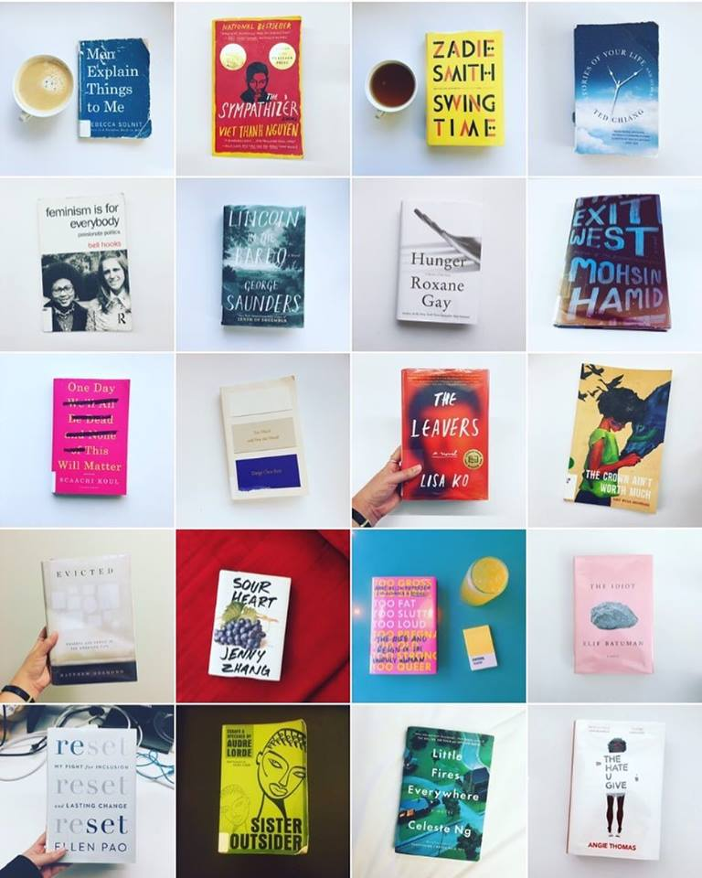

BACK ON MY BULLSHIT aka I read 52 books in 52 weeks for the [fourth year](https://www.goodreads.com/review/list/5789743?shelf=52-books-in-52-weeks-2017) in a row! (See blog posts from [2015](http://nicolezhu.github.io/52-books-in-52-weeks/), [2016](http://nicolezhu.github.io/52-books-in-52-weeks-year2/), and [2017](http://nicolezhu.github.io/52-books-in-52-weeks-year3/).)

## What I did differently this year
Last year, I made a conscious effort to document and diversify my reading with the help of a very intense [book-tracking spreadsheet](https://docs.google.com/spreadsheets/d/1JTrkx_8jeIJ_Q3vwwppr4_n9XULfNeD0Rt7ccMktums/edit?usp=sharing) — and it worked! So I continued that trend this year, and read mostly books by women/people of color again. The final count ended up being 33 books by women, 23 of those written by women of color, and 21 books by men, 15 of those written by men of color (plus 2 books that were each coauthored by a man and a woman).

In response to a [NYT tweet](https://twitter.com/nytimes/status/901142647703818242) crowdsourcing “books by women authors,” I wrote my [first tweetstorm](https://twitter.com/nicolelzhu/status/901471845173661696) about reading diversely and how it isn’t actually that hard to do some self-reflection, and more importantly, do the work of diversifying your literary environment. It was retweeted by awesome authors like [Jodi Picoult](https://twitter.com/jodipicoult/status/901581200770441216), [Jen Agg](https://twitter.com/TheBlackHoof/status/901781192722321408), and [Doree Shafrir](https://twitter.com/doree/status/901502995275198464) (whose book, *Startup*, I read this year), and I was able to write on the topic in a [piece for the Columbia Journalism Review](https://www.cjr.org/criticism/new-york-times-tweet-women-author.php). Also, it was pretty cool to have the NYT social media team [tweet back at me](https://twitter.com/nytimes/status/902263483407970309). ~Discourse~

Reading is usually a pretty solitary activity for me. Aside from the occasional social media update, I pretty much only chat regularly about the books I read with my boyfriend, who at this point knows that this is an evergreen topic for us to discuss (plus, he reads a lot too). However this year, I attended my first IRL book club (shoutout to [Girls’ Night In](https://twitter.com/girlsnightinHQ)) where we read Anne Helen Petersen’s essays *Too Fat, Too Slutty, Too Loud: The Rise and Reign of the Unruly Woman*. I also ran my first [book club discussion](https://docs.google.com/document/d/1Nz1ROHL66Tsa0LZM05FR9gaB1hGCee_eRAwon3LiM6k/edit) for the Asian employee resource group I co-run at Vox Media, where we read Celeste Ng’s novel *Little Fires Everywhere*. It was fun to put my English minor to good use, and putting together book club discussion questions definitely made me pause, appreciate, and analyze Ng’s book more seriously — themes, motifs, key passages, character development, all that SparkNotes jazz.

It was also really great to see more people taking on the 52 Books Challenge themselves! Yay for reading alone together!

<blockquote class="twitter-tweet" data-lang="en">
Goal: 36 books in 12 months (I typically top out at 24)  (Inspired by <a href="https://twitter.com/nicolelzhu?ref_src=twsrc%5Etfw">@nicolelzhu</a>’s challenge <a href="https://t.co/ZW1JhANoJH">https://t.co/ZW1JhANoJH</a>)  📚📆  let’s go!
&mdash; Sara (@dotsara) <a href="https://twitter.com/dotsara/status/917159473000570881?ref_src=twsrc%5Etfw">October 8, 2017</a></blockquote>

<blockquote class="twitter-tweet" data-lang="en">
taking some inspiration from <a href="https://twitter.com/nicolelzhu?ref_src=twsrc%5Etfw">@nicolelzhu</a> and doing my very own 52 books for 2018!  1/52 <a href="https://twitter.com/minjinlee11?ref_src=twsrc%5Etfw">@minjinlee11</a>’s pachinko truly inspiring how even in a book set in 1900s japan, the strength and resilience of the women is apparent <a href="https://t.co/KVwY5J68Hv">pic.twitter.com/KVwY5J68Hv</a>
&mdash; Rachel Luo (@rachelhluo) <a href="https://twitter.com/rachelhluo/status/948242534446305280?ref_src=twsrc%5Etfw">January 2, 2018</a></blockquote>

<blockquote class="twitter-tweet" data-lang="en">
📖 1/52: “Confiteor” by Jaume Cabré <a href="https://twitter.com/hashtag/52booksIn52weeks?src=hash&amp;ref_src=twsrc%5Etfw">#52booksIn52weeks</a> <a href="https://t.co/jYpF6VUSlF">pic.twitter.com/jYpF6VUSlF</a>
&mdash; Agis Tsaraboulidis ⛄️ (@agisilaosts) <a href="https://twitter.com/agisilaosts/status/948152164182044672?ref_src=twsrc%5Etfw">January 2, 2018</a></blockquote>

### Pages read per month:

    <canvas id="canvas" height="450" width="600"></canvas>

## Breakdown of books I read:
I continued to read a pretty even breakdown of fiction and nonfiction. This year I read slightly more poetry (Chen Chen, Rupi Kaur, Hanif Willis-Abdurraqib), and more collections of short stories (Ken Liu, Jenny Zhang, Ted Chiang) and essays (Samantha Irby, Durga Chew-Bose, Scaachi Koul). Most notably, I read significantly more books by Asian/Asian American writers in all genres, which was influenced by (1) [hosting Sweet and Sour](https://itunes.apple.com/us/podcast/sweet-and-sour/id1189796866?mt=2), a podcast centered on Asian American experiences, (2) Alex Laughlin’s great [#aznbooks2017 project](http://alexlaughs.com/aznbooks2017/), and (3) the ambient discussion in the great Vox Asians Slack channel/ERG at work.

Per my reading goals for 2017, I aimed to [“assemble a library of resistance.”](https://docs.google.com/document/d/1uYz0HVid83leyIjF5opvHkoCK58IUQNexxDg4U1qpoM/edit) I read about how modern congress works (*Act of Congress*), intersectional feminism (bell hooks, Audre Lorde), race and racial justice (James Baldwin, Wesley Lowery, Jeff Chang), gender discrimination in the workplace (Ellen Pao’s memoir, *Feminist Fight Club*), and cities and housing (*Evicted*, *The Death and Life of Great American Cities*).

The best fiction I read this year also dealt with topics like police brutality (*The Hate U Give*), refugees and war (Viet Thanh Nguyen), race and relationships (*Chemistry*, *Little Fires Everywhere*, *The Leavers*), and immigration (*Exit West*) in incredible and nuanced ways.

<blockquote class="twitter-tweet" data-lang="en">
1/52: &quot;Future Sex&quot; by Emily Witt <a href="https://twitter.com/hashtag/52booksin52weeks?src=hash&amp;ref_src=twsrc%5Etfw">#52booksin52weeks</a>
&mdash; Nicole Zhu (@nicolelzhu) <a href="https://twitter.com/nicolelzhu/status/829198149931634688?ref_src=twsrc%5Etfw">February 8, 2017</a></blockquote>

<blockquote class="twitter-tweet" data-lang="en">
52/52: &quot;The Hate U Give&quot; by <a href="https://twitter.com/angiecthomas?ref_src=twsrc%5Etfw">@angiecthomas</a> <a href="https://twitter.com/hashtag/52booksin52weeks?src=hash&amp;ref_src=twsrc%5Etfw">#52booksin52weeks</a> <a href="https://t.co/j6jBQJ3bIT">pic.twitter.com/j6jBQJ3bIT</a>
&mdash; Nicole Zhu (@nicolelzhu) <a href="https://twitter.com/nicolelzhu/status/932628434890706946?ref_src=twsrc%5Etfw">November 20, 2017</a></blockquote>

<blockquote class="twitter-tweet" data-lang="en">
56/52: &quot;The Paper Menagerie&quot; by <a href="https://twitter.com/kyliu99?ref_src=twsrc%5Etfw">@kyliu99</a> <a href="https://twitter.com/hashtag/52booksin52weeks?src=hash&amp;ref_src=twsrc%5Etfw">#52booksin52weeks</a> <a href="https://t.co/Yim7o3c4zi">pic.twitter.com/Yim7o3c4zi</a>
&mdash; Nicole Zhu (@nicolelzhu) <a href="https://twitter.com/nicolelzhu/status/946830858455003137?ref_src=twsrc%5Etfw">December 29, 2017</a></blockquote>

Most of the books I read were between 200-400 pages long, and though I didn’t read anything longer than 500 pages, I read an additional 4 books, bringing my grand total to 56. I continue to be a dedicated (millennial!) patron of the New York Public Library, which is still my greatest hack for reading as much as I do. Almost all the books I read this year were borrowed from the library, though a select few were birthday gifts from my sister (*Hunger*, *Sour Heart*) or part of Strand event admission tickets (Chimamanda Ngozi Adichie, Rebecca Solnit).

## How I track what I read
I tweet out a book when I finish it with the hashtag [#52booksin52weeks](https://twitter.com/search?q=%2352booksin52weeks%20from%3Anicolelzhu&src=typd). I use [Coach.me](https://www.coach.me/) and [Goodreads](https://www.goodreads.com/user/show/5789743-nicole) to track day-to-day progress. I’ve started to compile all of my tweets/books into Twitter moments for better discoverability: [2014](https://twitter.com/i/moments/946847331084898305), [2015](https://twitter.com/i/moments/946844864058183680), [2016](https://twitter.com/i/moments/946842035222401027), [2017](https://twitter.com/i/moments/946837658512347136).

## How I choose books to read
I’ve continued to add books to my [to-read list](https://docs.google.com/spreadsheets/d/1JTrkx_8jeIJ_Q3vwwppr4_n9XULfNeD0Rt7ccMktums/edit?usp=sharing) on my book tracking spreadsheet, usually as soon as possible so that I can  remember how I came across it. I still get most recommendations from friends, articles, newsletters, podcasts, authors I like/follow etc.

## A few favorites

- *Hunger: A Memoir of (My) Body* by Roxane Gay
- *The Paper Menagerie* by Ken Liu
- *Sister Outsider* by Audre Lorde
- *Little Fires Everywhere* by Celeste Ng
- *The Sympathizer* by Viet Thanh Nguyen
- *The Hate U Give* by Angie Thomas
- *Exit West* by Mohsin Hamid
- *We Are Never Meeting In Real Life* by Samantha Irby
- *Evicted* by Matthew Desmond
- *Hope in the Dark* by Rebecca Solnit
- *Too Much and Not the Mood* by Durga Chew-Bose

## What I’m doing differently this year
I hope to continue reading diversely in terms of gender and race, but I also hope to read more books by LGBTQ authors, authors who are not from the US or UK, and perhaps even more translated works (or maybe finally attempting to read Harry Potter AKA 哈利波特 in Chinese?!?). Reading so quickly often means that I don’t retain as much about the books I read as I’d like. Though I probably won’t analyze every book as if I was putting together book club questions, I’d like to sit and think and share more of what I read this year. As I mentioned in last year’s blog post, [per the NYPL](https://www.nypl.org/blog/2016/12/22/doing-2017-read-harder-challenge-try-these-books), my ongoing goal is simply reading “consciously, thoughtfully, and outside my comfort zone.”

Oh, and although I’m still going to read a lot, I’m also going to try and write more fiction and creative nonfiction! Follow me on [Twitter](https://twitter.com/nicolelzhu/) for updates on both!

