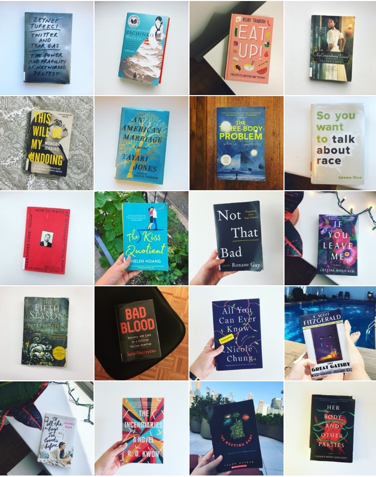

I’ve now read 52 books in 52 weeks for the [fifth year](https://www.goodreads.com/review/list/5789743-nicole?shelf=52-books-in-52-weeks-2018) in a row! I can't believe I've been doing this for _half a decade_ now. (See blog posts from [2015](http://nicolezhu.github.io/52-books-in-52-weeks/), [2016](http://nicolezhu.github.io/52-books-in-52-weeks-year2/), [2017](http://nicolezhu.github.io/52-books-in-52-weeks-year3/),  and [2018](http://nicolezhu.github.io/52-books-in-52-weeks-year4/).)

## What I did differently this year
I didn’t change up my reading habits as much as I have in previous years, since I feel pretty situated in my current routine (borrowing books from NYPL, reading on my commute/in the evenings/on the weekends). I still use my intense [book-tracking spreadsheet](https://docs.google.com/spreadsheets/d/1JTrkx_8jeIJ_Q3vwwppr4_n9XULfNeD0Rt7ccMktums/edit?usp=sharing) to track some metadata around the books and authors I read. The final count ended up being 46 books by women, 28 of those written by women of color, and 10 books by men, 6 of those written by men of color.

This was the year I discovered…romance novels! One of my favorite writers, [Ashley C. Ford](https://twitter.com/iSmashFizzle), wrote a [blog post](https://cupofjo.com/2018/01/best-smart-romance-novels/) in January recommending several romance novels, which served as my starting point for diving into the genre. I admit, I previously bought into the trope of romance novel readers as unsatisfied suburban housewives who enjoy reading about fellow white people falling in love, or that romance writing is all [galloping abs](https://www.youtube.com/watch?v=c36jCk-Cmvs) and [terribly written sex](https://www.theguardian.com/books/2018/nov/30/bad-sex-award-2018-the-contenders-in-quotes) that is akin to a pepper grinder. But the genre is [diversifying](https://www.nytimes.com/2018/07/07/books/romance-novels-diversity.html) and I really love how romance novels can model healthy relationships, promote [sex positivity](https://www.shondaland.com/inspire/books/a13123520/alisha-rai-writing-sex-consent-women-of-color-romance/), and portray [purposeful and enthusiastic consent](https://www.theatlantic.com/entertainment/archive/2018/10/proposals-jasmine-guillory-how-write-consent/571768/). About 20% of the books I read this year were romance novels, most of them by women of color and featuring women of color falling in love — shoutout to Jasmine Guillory, Alyssa Cole, Helen Hoang, and Alisha Rai.

<blockquote class="twitter-tweet" data-lang="en">
i recently started reading romance novels and i briefly considered not tweeting about them bc of the (sometimes) racy covers / general policing of what women like but HONESTLY FUCK THAT these books are great and i refuse to be ashamed for things that i read and enjoy
&mdash; Nicole Zhu (@nicolelzhu) <a href="https://twitter.com/nicolelzhu/status/993307939426504704?ref_src=twsrc%5Etfw">May 7, 2018</a></blockquote>

2018 was a very heavy, grim year and reading romance was a [refreshing break](https://www.shondaland.com/inspire/books/a13110264/medicine-for-melancholy-romance-novels-to-get-you-through-tough-times/) from the constant deluge of terrible news about terrible humans doing terrible things. The formulaic nature of romance novels is comforting — you always know that you'll get a happy ending.

This year, I was also all in on book clubs. At work, I co-run the Vox Asians Employee Resource Group [book club](https://twitter.com/nicolelzhu/status/958827327391260672), where we read *Pachinko*, *Crazy Rich Asians* (and organized a pre-screening for the movie), *Emergency Contact*, *Be Everything at Once*, and *All You Can Ever Know*. For [Eater Book Club](https://www.instagram.com/p/Bkd86SyhQQg/), where we read books about/involving food, I read *Cork Dork*, *Number One Chinese Restaurant*, and *The Way You Make Me Feel*. For [The Cosmos Book Club](https://www.instagram.com/cosmosbookclub/), a book club for Asian women featuring books by Asian women, I read  *A Thousand Beginnings and Endings* and *All You Can Ever Know* (two book clubs, one book!).

I frequented the [Asian American Writers Workshop](https://aaww.org/) so much this year for various book-related events that I'm now the mayor on Swarm! (Also probably because very few people know what Swarm even is.)

### Pages read per month:

    <canvas id="canvas" height="450" width="600"></canvas>

## Breakdown of books I read:
I read significantly more fiction this year than nonfiction (38 vs. 18). I read a few short story and essay collections (*Her Body and Other Parties*, *Nasty Women: Feminism, Resistance, and Revolution in Trump's America*), but didn’t read any poetry this year.

In nonfiction, I read about ethical technology (*Technically Wrong*, *Twitter and Tear Gas*, and *Weapons of Math Destruction*), race (*We Were Eight Years In Power*, *This Will Be My Undoing*, and *So You Want to Talk About Race*), and rape culture (*Not That Bad: Dispatches from Rape Culture*). I read a few memoirs (Alexander Chee, Gucci Mane, and Nicole Chung) and I continued to read a lot of Asian and Asian American authors, including many debut Asian American women authors such as R.O. Kwon, Lucy Tan, Crystal Hana Kim, and Lillian Li.

Per my romance novel kick, I read 12 romance novels, plus some YA romance like *Emergency Contact*, *The Way You Make Me Feel*, and *To All the Boys I’ve Loved Before*. I'm a sucker for these kinds of books. I somehow read 2/3 of two mind-bending sci-fi trilogies AT THE SAME TIME (Cixin Liu’s *The Three-Body Problem* and N.K. Jemisin’s *The Broken Earth*). I don’t know how I have managed to do this without melting my brain, but I plan on finishing the last books in both series in 2019.

<blockquote class="twitter-tweet" data-lang="en">
1/52: &quot;Technically Wrong: Sexist Apps, Biased Algorthms, and Other Threats of Toxic Tech&quot; by <a href="https://twitter.com/sara_ann_marie?ref_src=twsrc%5Etfw">@sara_ann_marie</a> <a href="https://twitter.com/hashtag/52booksin52weeks?src=hash&amp;ref_src=twsrc%5Etfw">#52booksin52weeks</a> <a href="https://t.co/T30W8H1mRn">pic.twitter.com/T30W8H1mRn</a>
&mdash; Nicole Zhu (@nicolelzhu) <a href="https://twitter.com/nicolelzhu/status/949842176472739840?ref_src=twsrc%5Etfw">January 7, 2018</a></blockquote>

<blockquote class="twitter-tweet" data-lang="en">
52/52: “The Way You Make Me Feel” by <a href="https://twitter.com/maurenegoo?ref_src=twsrc%5Etfw">@maurenegoo</a> <a href="https://twitter.com/hashtag/52booksin52weeks?src=hash&amp;ref_src=twsrc%5Etfw">#52booksin52weeks</a> <a href="https://t.co/DnKsgzXwO7">pic.twitter.com/DnKsgzXwO7</a>
&mdash; Nicole Zhu (@nicolelzhu) <a href="https://twitter.com/nicolelzhu/status/1066011668537327617?ref_src=twsrc%5Etfw">November 23, 2018</a></blockquote>

<blockquote class="twitter-tweet" data-lang="en">
56/52: “The Time Traveler’s Wife” by Audrey Niffenegger <a href="https://twitter.com/hashtag/52booksin52weeks?src=hash&amp;ref_src=twsrc%5Etfw">#52booksin52weeks</a> <a href="https://t.co/L9gFGivlsD">pic.twitter.com/L9gFGivlsD</a>
&mdash; Nicole Zhu (@nicolelzhu) <a href="https://twitter.com/nicolelzhu/status/1079194198782431233?ref_src=twsrc%5Etfw">December 30, 2018</a></blockquote>

I owe much of my reading success to the New York Public Library, which ensures that I read books by their due date as much as possible (and also helps me not bankrupt myself on books). Like the overachiever I am, I finished reading 52 books early this year, and read an extra 4 books before the end of 2018. I tend to read books between the range of 200-400 pages, though a few books were over 500 pages (*The Dark Forest*, *Pachinko*).

## How I track what I read
I tweet out a book when I finish it with the hashtag [#52booksin52weeks](https://twitter.com/search?q=%2352booksin52weeks%20from%3Anicolelzhu&src=typd). I use Coach.me and Goodreads to track day-to-day progress. I’ve started to compile all of my tweets/books into Twitter moments for better discoverability: [2014](https://twitter.com/i/moments/946847331084898305), [2015](https://twitter.com/i/moments/946844864058183680), [2016](https://twitter.com/i/moments/946842035222401027), [2017](https://twitter.com/i/moments/946837658512347136), and [2018](https://twitter.com/i/moments/1066118779330023424).

## How I choose books to read
I continuously add books to my to-read list on my book tracking spreadsheet and/or on Goodreads. I still get most recommendations from friends, articles, newsletters, podcasts, authors I like/follow etc. This year, I got book recs from [The New York Times](https://www.nytimes.com/interactive/2018/books/review/summer-reading-romance.html), [The New Yorker](https://www.newyorker.com/books/page-turner/sayaka-murata-eerie-convenience-store-woman-is-a-love-story-between-a-misfit-and-a-store), [Electric Literature](https://electricliterature.com/46-books-by-women-of-color-to-read-in-2018-70a0bf5bf4f2?gi=9699cedc2f99), [Elle](https://www.elle.com/culture/books/a14464215/morgan-jerkins-this-will-be-my-undoing-interview/), [BuzzFeed](https://www.buzzfeednews.com/article/bimadewunmi/time-for-tayari-jones), and [Shondaland](https://www.shondaland.com/inspire/books/a18211962/mallory-ortberg-interview-author-jasmine-guillory/).

## A few favorites

- *Pachinko* by Min Jin Lee
- *Eat Up: Food, Appetite and Eating What You Want* by Ruby Tandoh
- *An Extraordinary Union* by Alyssa Cole
- *This Will Be My Undoing: Living at the Intersection of Black, Female, and Feminist in (White) America* by Morgan Jerkins
- *An American Marriage* by Tayari Jones
- *The Three-Body Problem* by Cixin Liu
- *So You Want to Talk About Race* by Ijeoma Oluo
- *The Fifth Season* by N.K. Jemisin
- *How to Write an Autobiographical Novel* by Alexander Chee
- *The Kiss Quotient* by Helen Hoang
- *Bad Blood: Secrets and Lies in a Silicon Valley Startup* by John Carreyrou
- *All You Can Ever Know* by Nicole Chung

## What I’m doing differently this year
I took possession of my dad’s Kindle, which he never uses since he inexplicably prefers to read on an iPad, so I’m going to start reading and checking out more eBooks from the library. I still vastly prefer reading physical books, but the Kindle is great for travel (and I’m curious about Kindle Unlimited). I didn’t get around to reading any non-English books, but I’m going to try to find a Chinese audiobook of *The Three-Body Problem*. Since I read mostly fiction this year, I’ll be diving back into more nonfiction in 2019: Michelle Obama, Robin DiAngelo, Eve Ewing, Rebecca Traister, and Katherine Graham’s autobiography. Evan and I have talked about doing a [24-hour readathon](https://electricliterature.com/i-spent-24-hours-reading-last-weekend-and-i-didnt-lose-my-mind-30178d79e881) (reading 24 total hours over the course of two days) because we’re both giant book nerds, so hopefully we’ll get to cozy up one weekend and do that.

This past year, I followed through with my goal of writing more creative nonfiction and fiction. I wrote [750 words of fiction every day for 100 days](https://medium.com/@nz/what-i-learned-writing-750-words-of-fiction-every-day-for-100-days-ef75402d8a02), but they were mostly incomplete character sketches or scenes. In 2019, I hope to actually write complete short stories and start sending dispatches of my [fiction newsletter](https://twitter.us18.list-manage.com/subscribe?u=c87332e437f3b29dfd595a0e8&id=47a439520f), so I anticipate reading more short stories (and novels) to better inform my writing.

Follow me on [Twitter](https://twitter.com/nicolelzhu/) for reading and writing updates!

